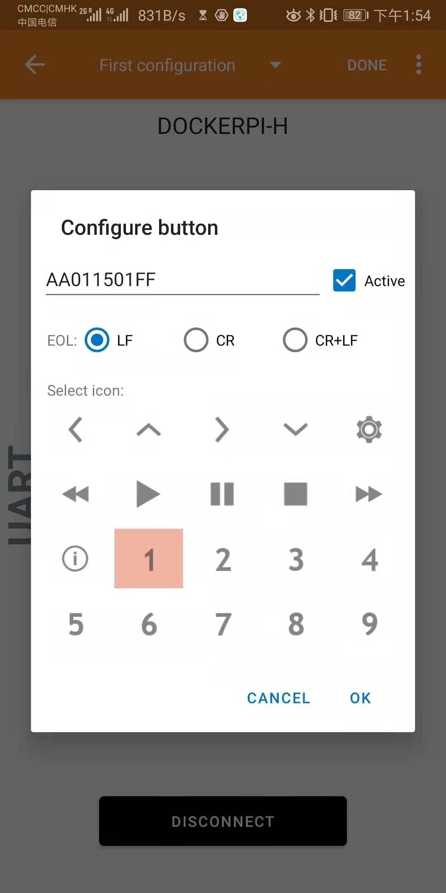

DockerPi Station Open Sources Project (Insider)

------

## Introduction

This project is open source code, software and hardware resources of DockerPi Station. Some resources are limit license from **Silicon Labs** and **Nordic Semiconductor**. For commercial use, it is notice to commercial authorization.

Main features of DockerPi Station:

> * Four data transfer protocols: HID, BLE, UART (ASCII), UART (RAW HEX)
> * Low power design (power consumption <10mA)
> * Open Source SDK support
> * Free for Academic use

Related resources:

> * [CP2112 HID USB-to-SMBus API Specification](https://www.mouser.com/pdfdocs/AN496.pdf)
> * [CP2112 Classic USB to UART Bridge
](https://www.silabs.com/products/interface/usb-bridges/classic-usb-bridges/device.cp2112)
> * [Nordic Semiconductor Infocenter](https://infocenter.nordicsemi.com/)
> * [Android-nRF-Toolbox Source](https://github.com/NordicSemiconductor/Android-nRF-Toolbox)
> * [IOS-nRF-Toolbox Source](https://github.com/NordicSemiconductor/IOS-nRF-Toolbox)
> * [nRF5 SDK](https://www.nordicsemi.com/Software-and-Tools/Software/nRF5-SDK)

Project directory structure:

> * Release Binary File:SDK\examples\ble_peripheral\ble_app_dockerpi\hex\ble_app_dockerpi_pca10040e_s112.hex
> * Debug Project:SDK\examples\ble_peripheral\ble_app_dockerpi\ministation\s112\arm5_no_packs
> * Hardware Design: HDK\\*

------

## Communication Protocol (BLE/UART)

The communication protocol is used to stipulate how the product accepts commands. You can also modify this protocol to suit your product. The communication protocol is only used for BLE/UART (including ASCII/HEX) communication.

| Function | Preamble | Direction | CHIP-ADDRESS | DATA-ADDRESS |
| ---- | ---- | ---- | ---- | ---- |
| Length | 1 | 1 | 1 | 1 |
| Comment | AA | 00 => i2c-get | I2C_ADDR_RANGE | DATA-ADDRESS |

| Function | Preamble | Direction | CHIP-ADDRESS | DATA-ADDRESS | VALUE |
| ---- | ---- | ---- | ---- | ---- | ---- |
| Length | 1 | 1 | 1 | 1 | * |
| Comment | AA | 00 => i2c-set | I2C_ADDR_RANGE | DATA-ADDRESS | DATA |

For example:

```c
AA011501FF => i2c-set -y 1 0x15 0x01 0xff
AA001501 => i2c-get -y 1 0x15 0x01
```

ASCII characters can be sent on the Bluetooth software and can be interpreted automatically.



You can also send ASCII characters or hexadecimal data directly on the serial port tool, but you need to send a newline character to end, line feeds support \n or \r.

For more instructions, check out our WIKI connection: [Go To Wiki] (https://wiki.52pi.com)